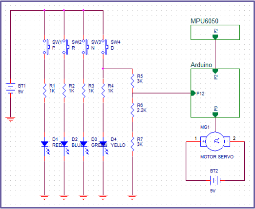

# AutoBrake

● 경사로에 차량을 주차할 시 자동으로 Sidebrake가 작동되는 시스템입니다.

# 개요

● 차량을 경사로에 주차하여 발생하는 차량 밀림 사고를 예방하고자 제작하게 되었습니다.

● 차량의 시동이 꺼진 상태에서 기어가 P에 놓이면, 자이로센서(MPU-6050)가 기울기 각도를 측정하여 경사로 라고 인식 하게되어 모터를 구동시켜 Sidebrake를 작동 시킨다.

# 시스템 구조도

● Arduino Uno 보드를 메인으로 하여 MPU-6050으로 측정한 기울기 각도를 기반으로 시스템을 제어한다.

● 내부 회로

● 다음 3가지 조건을 모두 만족할 경우 AUTO BRAKE가 작동하도록 구현하였습니다.

	1) 차량의 시동이 완전히 꺼져있어야 한다.
	
	2) 차량의 기어 위치가 P상태(Parking)여야 한다.
	
	3) 차량 주차 위치가 경사로, 즉 차량의 기울기(-11º 이하, 11º 이상)가 감지되어야 한다.

# 개발 환경

● OS : windows 7 Professional K 64 bit

● CPU : Intel(R) Core(TM) i3-4130 CPU @ 3.40GHz

● RAM : 8Gb

● IDE : Arduino IDE 1.8.1

# 구동 영상 URL

[바로가기](https://youtu.be/NYib8b574DY)

# 활용방안

● 유모차나 휠체어 바퀴에 장착하여 보호자가 유모차 또는 휠체어를 놓쳐 발생하는 사고 예방.

● 무게중심 쏠림에 의한 중장비 전복사고 예방.

# 추후 개선사항

1) 자이로 센서(MPU-6050)의 특성상 정지 상태에서 시간이 지날수 록 좌표 계산하는 과정에서 오차가 발생하여 누적되기 때문에 가속도 센서를 추가로 장착하여 좀 더 세밀한 조정이 필요하다.

2) 릴레이를 추가로 장착하여 차량의 시동이 꺼져있더라도 경사로에 진입된 것을 센서가 감지하여 자이로센서가 작동 되게 하는 인터럽트를 구성하여 시동이 꺼져 있어도 대기 전력을 사용하지 않게 수정할 필요가 있다.

